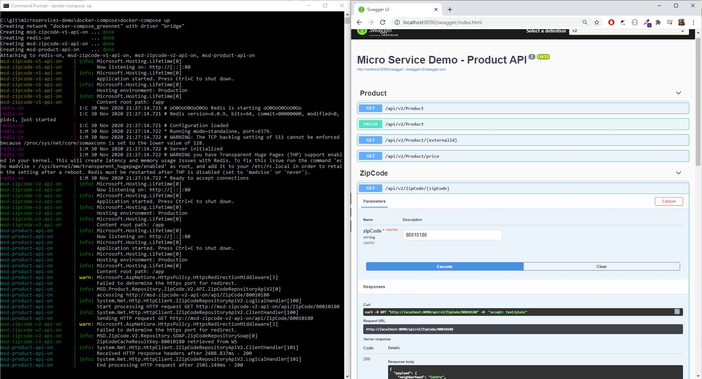

# Welcome to Microservices Demo!

In this repository you can find 3 microservices, and some techs that you probably will enjoy.
:)

In order **to run** the all the services, there is a folder with the **docker-compose.yaml**. After that you will find an Swagger UI in the http://localhost:8090/swagger.

## 1-) Microservice **Product**: 
The idea behind this Service is to be a **API REST**, to get products list from another API, and set price to them.

Let's assume that you have an external API with your products catalogue. I this case it was used the Star Wars API https://swapi.dev/. 

The service will consume items from the Star Wars API and it possible to set price for those items. the prices it is stored in memory db using **Entity Framework Core**.

Also it integrates another service to get address details from a ZipCode (the implementation is based on Correios Brazilian Post Service). There are two integrations, one with cache and another without it. This way we have an API/Versioning system, with a deprecated operation.

The service is built on **.NET Core 3.1**. There is a **Circuit Breaker** in the consumption of the APIs, using **Polly** (3 calls, 2 seconds of interval). The **API is versionated** and documentated with **Swagger**.

The internal structure of the Solution and Projects is based on vast concepts of **DDD**.

## 2-) Microservice ZipCode V1:
Here we have a wrapper for Correios Postal Service **SOAP** webservice, using **WCF** to consume and exposing the data in **JSON** with **API REST** calls. It is a very simple microservice and that is the ideia with it.
Despite of the simplicity, the service also contains **Swagger** documentation It is built on **.NET Core 3.1**.

## 3-) Microservice ZipCode V2:
Is the evolution of ZipCode V1. It already has some concepts of **DDD**, but mainly use a cache system with **Redis** (with 20 seconds of cache).

As usual, it is built on **.NET Core 3.1** and has **Swagger** as well.

## Docker
Each project has its own **Docker file** to build the images. Also there is a **docker-compose.yaml** to run all the microservices and the **Redis**. There is no necessity of database, because the data is persisted in memory.

## Wrap Up 
This is a demo, not a final product. But is very interesting study the structure and technologies used in these implementations, to bring that to your real projects. So enjoy!
